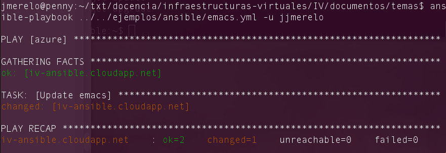

#Infraestructura como servicio

##Objetivos

1. Diseñar, construir y analizar las prestaciones de un centro de
  proceso de datos virtual. 
2. Documentar y mantener una plataforma virtual.
3. Realizar tareas de administración en infraestructura virtual.
4. Aprender lenguajes de configuración usados en infraestructuras virtuales.
2. Saber cómo aplicarlos en un caso determinado.
3. Conocer los sistemas de gestión de la configuración,
provisionamiento y monitorizació más usados hoy en día.

Introducción
---

La parte más baja de la pila de soluciones en la nube, *IaaS* o Infraestructura como servicio,, consiste
básicamente en el uso de máquinas virtuales junto con lo necesario
para que funcionen: almacenamiento virtual y dispositivos virtuales de
red. Ellas fueron las que iniciaron la nube, sobre todo con el
lanzamiento de
[EC2, Elastic Compute Cloud](http://es.wikipedia.org/wiki/Amazon_EC2),
la *nube* de Amazon que vino asociada al de
[S3, Simple Storage Service](http://en.wikipedia.org/wiki/Amazon_S3),
que fue lanzado a la vez, un servicio de almacenamiento de datos (que puede usarse también de forma independiente), y [Amazon EBS (Elastic Block Store)](http://en.wikipedia.org/wiki/Amazon_Elastic_Block_Store), un almacenamiento permanente para imágenes de sistemas operativos completos, usables, por ejemplo, para almacenar el estado de una máquina virtual completo. La presencia de la palabra *elastic* en dos de estas ofertas indica la principal diferencia entre la nube y el uso de un VPS o Servidor Privado Virtual: mientras que un VPS es simplemente una máquina virtual con recursos limitados, los recursos a los que tienes acceso desde la nube son *elásticos* y se van ampliando según la demanda que haya de la forma que se haya definido y de forma transparente para la aplicación y para el usuario, con el único límite que el usuario haya definido y pueda asumir.

Después de Amazon han llegado muchas otros productos al mercado: [Azure de Microsoft](http://en.wikipedia.org/wiki/Microsoft_Azure) y [Google Compute Engine](http://en.wikipedia.org/wiki/Google_Compute_Engine) son posiblemente los más populares. Los productos son similares en precio y en prestaciones, lo que ocurre es que difieren en el ecosistema de productos desarrollados alrededor, en los que Amazon está, por lo pronto, más desarrollado que el resto.

Todos estos sistemas permiten gestionar nubes "públicas", pero hay también productos que permiten crear y gestionar tu propia nube privada. El principal es [OpenStack](http://es.wikipedia.org/wiki/OpenStack), un producto de fuentes abiertas (como todo lo relacionado con la nube) que permite gestionar los diferentes aspectos de una nube privada: instancias de máquinas virtuales e imágenes. OpenStack es un producto interesante para dotar centros de datos y poder crear y provisionar máquinas virtuales sin depender de proveedores externos, pero en todo caso la gestión de máquinas virtuales es totalmente independiente de quién físicamente las cree o provea.

>Otro producto español, [OpenNebula](http://opennebula.org/), es bastante competitivo y está en el mismo nicho, pero no es tan popular en los centros de datos más habituales. Por supuesto, también es OpenSource. 

Las infraestructuras virtuales se gestionan a través de una serie de herramientas denominadas, en general,
[gestores de configuración](http://en.wikipedia.org/wiki/Configuration_management). [Vagrant](http://en.wikipedia.org/wiki/Vagrant_%28software%29)
es uno de ellos, pero también hay otros: [Chef](http://www.getchef.com/chef/), Salt y Puppet, por
ejemplo. Todos son libres, pero
[tienen características específicas](http://en.wikipedia.org/wiki/Comparison_of_open_source_configuration_management_software)
que hay que tener en cuenta a la hora de elegir uno u otro. En el caso
específico de
[sistemas operativos](http://en.wikipedia.org/wiki/Configuration_management#Operating_System_configuration_management)
se trata de gestionar automáticamente todas las tareas de
configuración de un sistema, automatizando la edición de ficheros de
configuración, instalación de software y configuración del mismo,
creación de usuarios y autenticación, de forma que se pueda hacer de
forma automática y masiva. 

A continuación veremos diferentes ejemplos de sistemas de
configuración, empezando por Chef. Dejaremos de lado otros sistemas como `Juju`, un ejemplo de
sistema de configuración también, aunque específico de Ubuntu y `docker`, un sistema de creación y gestión de máquinas virtuales *ligeras*. Es bastante útil, pero no cubre toda la gama de sistemas virtuales como hacen estos sistemas de configuración.

>Docker, por otro lado, es una herramienta excelente para crear
>configuraciones virtuales dentro de un solo
>ordenador. [Échale un vistazo al tutorial](https://www.docker.com/tryit/)
>para hacerte una idea de sus capacidades.

A partir de aquí te hará falta una máquina virtual para trabajar,
preferiblemente una en la que puedas instalar cualquier tipo de
sistema operativo y que esté *limpio* o al menos con el mínimo
necesario. Puedes usar [koding.com](http://koding.com), por ejemplo,
que proporciona una máquina virtual para desarrollo que puedes
desconectar cuando dejes de hacer los ejercicios. También puedes,
previa alta de tarjeta de crédito, usar las máquinas virtuales
gratuitas que proporcionan Google, Amazon o Azure (no tendrás que
pagar si no te pasas de los recursos gratuitos). También puedes
trabajar con máquinas virtuales en tu propio ordenador usando
VirtualBox o cualquier otro hipervisor; en este caso necesitarás una
conexión adecuada para bajarte rápidamente las imágenes sobre las que
trabajarás. 

##Trabajando con la nube

A partir de un IaaS, hay todo tipo de servicios que se sitúan entre una infraestructura como servicio y otros más avanzados de tipo PaaS o incluso SaaS; en muchos casos ofrecen demos o máquinas virtuales que se pueden usar por tiempo limitado. Por ejemplo, [Bitnami](http://bitnami.com), una empresa originalmente española, ofrece máquinas virtuales con aplicaciones ya instaladas que se pueden lanzar como demo.

>Probar a lanzar una máquina virtual de demo, configurando las aplicaciones que se desee, y viendo qué posibilidades ofrece. Las MVs de demostración tienen que lanzarse obligatoriamente en la costa este americana y tener una aplicación instalada. Aparte, tarda unos buenos minutos en construirse (lo que no sé si se descontará o no de la hora total).

Usando Chef para provisionamiento
-----

Cualquier instancia de máquina virtual que se adquiera debe
 *provisionarse*, es decir, configurarse y, en el espíritu *DevOps*,
 hacerse de forma reproducible y automática. Por eso se han venido
 usando tradicionalmente diferentes herramientas para llevar a cabo
 esa labor.
 
 [Chef](http://www.getchef.com/chef/) es una de ellas y, en
 general, se usa en un servidor que se encarga no sólo de gestionar la
 configuración, sino también las versiones. Empezar a usarlo
 [es complicado](http://wiki.opscode.com/display/chef/Documentation).
 Sin embargo, como
 introducción a la gestión de configuraciones se puede usar
 [`chef-solo`](http://docs.opscode.com/chef_solo.html), una versión
 aislada que permite trabajar en una máquina desde la misma (es decir,
 tienes que conectarte a la máquina y ejecutar la configuración en
 Chef dentro de ella) y que, por
 tanto, se puede usar como introducción a la gestión de
 configuraciones y para probar las mismas.
 
 
> Hay varios tutoriales que te permiten, con relativa rapidez, comenzar
>  a trabajar con Chef-solo en un servidor;
>  [este te proporciona una serie de ficheros que puedes usar](http://www.opinionatedprogrammer.com/2011/06/chef-solo-tutorial-managing-a-single-server-with-chef/)
>  y
>  [este otro es más directo, mostrándote una serie de órdenes](http://www.mechanicalrobotfish.com/blog/2013/01/01/configure-a-server-with-chef-solo-in-five-minutes/). En
>  todo caso, se trata básicamente tener acceso a un servidor o máquina
>  virtual, instalar una serie de aplicaciones en él y ejecutarlas sobre
>  un fichero de configuración. 
 

En una máquina de tipo Ubuntu, hay que comenzar instalando Ruby y Ruby
Gems; como siempre, es mucho más fácil si ya se ha instalado el gestor de versiones `rvm` o [`rbenv`](https://github.com/sstephenson/rbenv). `chef` se distribuye como una gema (un módulo o biblioteca de Ruby), por lo que se
puede instalar siempre como

	gem install ohai chef

>con `sudo` si se está trabajando con el Ruby "del sistema", también como siempre.

[ohai](http://docs.opscode.com/ohai.html) acompaña a `chef` y es usado
desde el mismo para comprobar características del nodo (el sistema en el que vamos a instalar algo)  antes de
ejecutar cualquier receta.

Una [forma más rápida de instalar Chef](http://gettingstartedwithchef.com/first-steps-with-chef.html) es descargarlo directamente desde la página web:

	curl -L https://www.opscode.com/chef/install.sh | bash

La última tendrá que ser `sudo bash` en caso de que se quiera instalar
como administrador. Chef tendrá que estar instalado en el *nodo* (o
máquina virtual) sobre
el que vayamos a ejecutar las recetas.

Para usar `chef-solo` hay simplemente que instalar unos cuantos
programas, pero en gran parte ya está automatizado:
[aquí explica como usarlo en Ubuntu 12.04](http://www.wolfe.id.au/2012/09/10/how-i-use-chef-solo-with-ubuntu-12.04/),
por ejemplo basándose en
[este Gist (programas cortos en GitHub)](https://gist.github.com/wolfeidau/3328844)
que instala todas las herramientas necesarias para comenzar a ejecutar
Chef. 

> Este
> [curso en video](http://nathenharvey.com/blog/2012/12/06/learning-chef-part-1/)
>te enseña también a trabajar con Chef.

En ciertos sabores de Linux puede ser algo complicado o en todo caso
específico de ese sistema operativo, por lo que en muchos casos se
ofrecen ya imágenes que tienen Chef (y otras herramientas, como
Puppet) instaladas. 

>Instalar `chef` en la máquina virtual que vayamos a usar o descargarse una máquina virtual con `chef` ya instalado. 

Una *receta* de Chef
[consiste en crear una serie de ficheros](http://www.mechanicalrobotfish.com/blog/2013/01/01/configure-a-server-with-chef-solo-in-five-minutes/):
una *lista de ejecución* que especifica qué es lo que se va a
configurar; esta lista se incluye en un fichero `node.json`, 
o *recetario* (*cookbook*) que incluye una serie de *recetas* que
configuran, efectivamente, los recursos y, finalmente, un fichero de
configuración que dice dónde están los dos ficheros anteriores y
cualquier otro recursos que haga falta. Estos últimos dos ficheros
están escritos en Ruby. 

Vamos a empezar a escribir una recetilla del Chef. Generalmente,
[escribir una receta es algo más complicado](http://reiddraper.com/first-chef-recipe/),
pero comenzaremos por una receta muy simple que instale el
imprescindible `emacs` y cree una serie de ficheros en el mismo. Creamos el
directorio `chef` en algún sitio conveniente (por ejemplo,
`/home/miusuario/chef`; dentro de ese
directorio irán diferentes ficheros.

El fichero que contendrá efectivamente la receta se
llamará [`default.rb`](chef/cookbooks/emacs/recipes/default.rb)

	package 'emacs'
	directory '/home/jmerelo/Documentos'
	file "/home/jmerelo/Documentos/LEEME" do
		owner "jmerelo"
		group "jmerelo"
		mode 00544
		action :create
		content "Directorio para documentos diversos"
	end

El nombre del fichero indica que se trata de la receta por omisión,
pero el nombre de la receta viene determinado por el directorio en el
que se meta, que podemos crear de un tirón con

	mkdir -p chef/cookbooks/emacs/recipes

Este fichero tiene tres partes: instala el paquete `emacs`, crea un
directorio para documentos  y dentro de él un fichero que explica, por
si hubiera duda, de qué se trata. Evidentemente, tanto caminos como
nombres de usuario se deben cambiar a los correspondientes en la
máquina virtual que estemos configurando.

El siguiente fichero, [`node.json`](chef/node.json),
incluirá una referencia a esta receta

	{
		"run_list": [ "recipe[emacs]" ]
	}

Este fichero, que evidentemente, está en formato JSON, hace referencia a un recetario, `emacs` y dado que no se
especifica nada más se ejecutará la receta por defecto, la que hemos
creado anteriormente. 

Finalmente, el [fichero de configuración `solo.rb`](chef/solo.rb) incluirá referencias a ambos.

	file_cache_path "/home/jmerelo/chef"
	cookbook_path "/home/jmerelo/chef/cookbooks"
	json_attribs "/home/jmerelo/chef/node.json"
	
Una vez más, *cambiando los caminos por los que correspondan*. Para
ejecutarlo,

	sudo chef-solo -c chef/solo.rb

(si se ejecuta desde el directorio raíz), *que hay que ejecutar en la máquina en la que se vaya a ejecutar*). Esta orden producirá una
serie de mensajes para cada una de las órdenes y, si todo va bien,
tendremos este útil editor instalado. `-c` indica que se trata del
fichero de configuración. Si se ejecuta `chef-solo` desde el
directorio `chef` tomará, por defecto, ese fichero. 

El resultado será algo similar a esto:

	Starting Chef Client, version 11.4.4
	Compiling Cookbooks...
	Converging 3 resources
	Recipe: emacs::default
	  * package[emacs] action install
		- install version 45.0 of package emacs

	  * directory[/home/vagrant/Documentos] action create
		- create new directory /home/vagrant/Documentos

	  * file[/home/vagrant/Documentos/LEEME] action create
		- create new file /home/vagrant/Documentos/LEEME with content checksum 570035
			--- /tmp/chef-tempfile20150113-3101-18xluwi	2015-01-13 19:39:34.000000000 +0000
			+++ /tmp/chef-diff20150113-3101-i9zwnc	2015-01-13 19:39:34.000000000 +0000
			@@ -0,0 +1 @@
			+Directorio para documentos diversos

	Chef Client finished, 3 resources updated

Donde se informa de la actividad de cada una de las tres acciones:
instalar `emacs`, crear un directorio y finalmente crear un fichero
con un contenido determinado. Sólo se instalará `emacs` si,
efectivamente, existe un paquete con ese nombre y si no se ha
instalado anteriormente, claro. 

>Crear una receta para instalar el servidor web de alts prestaciones `nginx`, tu editor favorito (`vim`, por ejemplo) y algún
>directorio y fichero que uses de forma habitual.

Cuando se está trabajando con un IaaS, en muchos casos tendrán
imágenes ya preparadas con Chef instalado. Por ejemplo, en
[Vagrant Boxes](http://vagrantbox.es) tienen varias imágenes de
CentOS, Debian y Ubuntu con chef ya instalado.

> De ninguna manera JSON es un lenguaje universal para gestión de
> configuraciones. Prácticamente todo el resto de los sistemas de
> configuración usan
> [YAML (*yet another markup language*)](http://yaml.org). Recientemente
> se ha
> [publicado una introducción al tema](http://pharalax.com/blog/yaml-introduccion-al-lenguaje-yaml/)
> que será suficiente para el uso que le vamos a dar más adelante

Ya hemos usado YAML en la configuración de
[Travis](http://travis-ci.org). En todo caso, los lenguajes de
configuración suelen ser simples y se aprenden rápidamente.

>Escribir en YAML la siguiente estructura de datos en JSON

	{ uno: "dos",
      tres: [ 4, 5, "Seis", { siete: 8, nueve: [ 10, 11 ] } ] }
	  

Normalmente estas recetas van a estar bajo control de un sistema de
gestión de fuentes; de esta forma se pueden probar diferentes
configuraciones, crear nuevas versiones de la misma pero, sobre todo,
tener claro en cada momento qué configuración es la que se está
ejecutando en producción, que será habitualmente la que esté en una
rama designada de la misma.

>Todas estas pruebas se pueden hacer sobre una máquina virtual que se
instale localmente con VirtualBox o cualquier otro sistema como Xen o
con máquinas remotas. Algunos sitios, como
[Koding](http://koding.com), ofrecen máquinas virtuales que no están
encendidas de forma permanente, pero se pueden usar para pruebas. Como
ejercicio, darse de alta en Koding y configurar la máquina virtual
[creando un par clave pública/privada](http://www.petefreitag.com/item/532.cfm)
y copiándola al directorio
[`.ssh` y el fichero `authorized_keys2`](http://learn.koding.com/guides/ssh-into-your-vm/)
para que se pueda conectar a la máquina sin necesidad de introducir el
*password* cada vez. Si se tiene cualquier otra máquina virtual,
proceder de la misma forma.

Otros sistemas de gestión de configuración
---

Las principales alternativas a Chef son [Ansible](http://ansible.com),
[Salt](http://www.saltstack.com/), [Rex](http://www.rexify.org/) y [Puppet](http://docs.puppetlabs.com/guides/installation.html). Todos ellos se comparan en
[este artículo](http://www.infoworld.com/d/data-center/review-puppet-vs-chef-vs-ansible-vs-salt-231308),
aunque los principales contendientes son
[Puppet y Chef, sin que ninguno de los dos sea perfecto](http://www.infoworld.com/d/data-center/puppet-or-chef-the-configuration-management-dilemma-215279?source=fssr). 

De todas ellas, vamos a
[ver Ansible](http://davidwinter.me/articles/2013/11/23/introduction-to-ansible/)
que parece ser uno de los que se está desarrollando con más intensidad
últimamente. [Ansible es](http://en.wikipedia.org/wiki/Ansible_%28software%29)
sistema de gestión remota de configuración que permite gestionar
simultáneamente miles de sistemas diferenets. Está basado en YAML para
la descripción de los sistemas y escrito en Python. 

Se instala como un módulo de Python, usando por ejemplo la utilidad de
instalación de módulos `pip` (que habrá que instalar si no se tiene)

	sudo pip install paramiko PyYAML jinja2 httplib2 ansible
	
El resto de las utilidades son también necesarias y en realidad se
instalan automáticamente al instalar ansible. Estas utilidades se
tienen que instalar *en el anfitrión*, no hace falta instalarlas en el
invitado, que lo único que necesitará, en principio, es tener activada
la conexión por ssh y tener una cuenta válida y forma válida de
acceder a ella.

Cada máquina que se añada al control de Ansible se tiene que añadir a
un
[fichero, llamado inventario](http://docs.ansible.com/intro_inventory.html),
que contiene las diferentes máquinas controladas por el mismo. Por
ejemplo

	 $ echo "ansible-iv.cloudapp.net" > ~/ansible_hosts
	
se puede ejecutar desde el *shell* para meter (`echo`) una cadena con
una dirección (en este caso, una máquina virtual de Azure) en el
fichero `ansible_hosts` situado en mi directorio raíz. El lugar de ese
fichero es arbitrario, por lo que habrá que avisar a Ansible donde
está usando una variable de entorno:

	export ANSIBLE_HOSTS=~/ansible_hosts
	
Y, con un nodo, ya se puede comprobar si Ansible funciona con 

	$ ansible all -u jjmerelo -m ping
	
Esta orden hace un *ping*, es decir, simplemente comprueba si la
máquina es accesible desde la máquina local. `-u ` incluye el nombre
del usuario (si es diferente del de la máquina local); habrá que
añadir `--ask-pass` si no se ha configurado la máquina remota para
poder acceder a ella sin clave. 

De forma básica, lo que hace Ansible es simplemente ejecutar comandos
de forma remota y simultáneamente. Para hacerlo, podemos usar el
[inventario para agrupar los servidores](http://docs.ansible.com/intro_inventory.html), por ejemplo

	[azure]
	iv-ansible.cloudapp.net

crearía un grupo `azure` (con un solo ordenador), en el cual podemos
ejecutar comandos de forma remota

	$ ansible azure -u jjmerelo -a df
	
nos mostraría en todas las máqunias de azure la organización del
sistema de ficheros (que es lo que hace el comando `df`). Una vez más,
`-u` es opcional. 

Esta orden usa un *módulo* de ansible y se puede ejecutar también de
esta forma:

	$ ansible azure -m shell ls
	
haciendo uso del módulo `shell` (si está instalado). Hay muchos
[más módulos](http://docs.ansible.com/modules.html) a los que se le
pueden enviar comandos del tipo "variable = valor". Por ejemplo, se
puede trabajar con servidores web o
[copiar ficheros](http://docs.ansible.com/intro_adhoc.html#file-transfer)
o
[incluso desplegar aplicaciones directamente usando el módulo `git`](http://docs.ansible.com/intro_adhoc.html#managing-packages)

> Desplegar los fuentes de la aplicación para gestionar las porras (o cualquier otra aplicación) que se
> encuentre en un servidor git público en la máquina virtual Azure (o
> una máquina virtual local) usando ansible.

Finalmente, el concepto similar a las recetas de Chef en Ansible son los
[*playbooks*](http://davidwinter.me/articles/2013/11/23/introduction-to-ansible/),
ficheros en YAML que le dicen a la máquina virtual qué es lo que hay
que instalar en *tareas*, de la forma siguiente

	---
	- hosts: azure
	  sudo: yes
	  tasks:
		- name: Update emacs
		  apt: pkg=emacs state=present

Esto se guarda en un fichero y se
[le llama, por ejemplo, emacs.yml](../../ejemplos/ansible/emacs.yml),
y se ejecuta con 

  ansible-playbook ../../ejemplos/ansible/emacs.yml 
  
(recordando siempre el temita del nombre de usuario), lo que dará, si
todo ha ido bien, un resultado como el siguiente

En el fichero YAML lo que se está expresando es un array asociativo
con las claves `hosts`, `sudo` y `tasks`. En el primero ponemos el
bloque de servidores en el que vamos a actuar, en el segundo si hace
falta hacer sudo o no y en el tercero las tareas que vamos a ejecutar,
en este caso una sola. El apartado de tareas es un vector de hashes,
cada uno de los cuales tiene en `name` el nombre de la tarea, a título
informativo y en las otras claves lo que se va a hacer; `apt` indicará
que hay que instalar un paquete (`pkg`) llamado `emacs` y que hay que
comprobar si está presente o no (`state`). El que se trabaje con
*estados* y no de forma imperativa hace que los *playbooks* sean
*idempotentes*, es decir, si se ejecutan varias veces darán el mismo
resultado que si se ejecutan una sola vez. 

> Desplegar la aplicación realizada hasta el momento  con todos los módulos necesarios
> usando un *playbook* de Ansible.

[Salt](http://saltstack.com) también es otro sistema de configuración
popular. Está también basado en Python y considera el concepto de
[estado](http://docs.saltstack.com/en/latest/topics/tutorials/walkthrough.html)
fundamental. Tiene un sistema cliente-servidor, o amo-esbirro
(*minion*), que necesita instalar servicios tanto en el amo como en el
esbirro para empezar a trabajar con él (a diferencia de Ansible, que
permite ejecutar remotamente con facilidad). Los ficheros de
configuración están basados en YAML y, en general, se trata de un
sistema interesante y popular, aunque algo más complicado de
configurar que Ansible y Chef (aunque este último no permite ejecución
remota en la opción `solo`).

[Puppet](http://puppetlabs.com) es otra opción; no sé si popular, pero
al menos existente y
madura. [Tiene un lenguaje de configuración propio](https://davidwinter.me/introduction-to-puppet/),
pero se puede usar desde Vagrant (que se verá a continuación). Es
posible que sea tan potente, o más, que los anteriores, pero la falta
de una documentación de introducción asequible y rápida, para mi, lo
descarta.

>En
>[este artículo](http://kev009.com/wp/2012/01/configuration-management-software-sucks/)
>dicen que en 2012 era la mejor opción, "but it sucks". En esos
>momentos, por supuesto, no existían ninguno de los otros que
>comentamos aquí o no estaban lo suficientemente maduros. De acuerdo
>con
>[este estudio](http://redmonk.com/sogrady/2013/12/06/configuration-management-2013/)
>es difícil decir cuál se impondrá en el futuro, por lo que es
>conveniente saber al menos uno más de ellos, aparte de Chef. 

Finalmente, [Rex](http://rexify.org) es un sistema basado en Perl, que
básicamente permite la ejecución remota de comandos y se puede usar
para configuraciones simples en sistemas a los que se tenga acceso y
donde no haya nada razonable instalado. Necesita conocer de antemano
el tipo del sistema operativo, ya que lanza diferentes comandos
dependiendo de qué se trate, por lo que para sabores exóticos de Linux
puede dar algún problema. Para configuraciones simples y una puesta a
punto rápida, es tan fácil trabajar con él como con Ansible.

Orquestación de máquinas virtuales
---------------

A un nivel superior al provisionamiento de máquinas virtuales está la configuración,
orquestación y gestión de las mismas, herramientas como
[Vagrant](http://vagrantup.com) ayudan a hacerlo, aunque también
Puppet e incluso Juju pueden hacer muchas de las funciones de
Vagrant. Algunas alternativas son
[Vortex](http://www.websecurify.com/extra/vortex.html). Las herramientas de configuración permiten trabajar *dentro* de la máquina. Las orquestación y gestión se hace con herramientas que abstraen las características particulares del gestor y permite configurar las características de la máquina, así como trabajar con ellas de forma masiva y arrancarlas, apagarlas y conocer el status.

Vagrant puede trabajar con
[diferentes tipos de hipervisores](https://docs.vagrantup.com/v2/providers/index.html). Por
omisión trabaja con VirtualBox, pero se puede configurar para trabajar
con VMWare o con cualquier otro proveedor de máquinas virtuales,
incluyendo virtualización ligera con docker.  

La ventaja de Vagrant es que permite gestionar el ciclo de vida
completo de una máquina virtual, desde la creación hasta su
destrucción pasando por el provisionamiento y la monitorización o
conexión con la misma. Además, permite trabajar con todo tipo de
hipervisores y provisionadores tales como los que hemos visto
anteriormente.

Con Vagrant [te puedes descargar directamente](https://gist.github.com/dergachev/3866825)
[una máquina configurada de esta lista](http://www.vagrantbox.es/). Por
ejemplo, 

	vagrant box add centos65 https://github.com/2creatives/vagrant-centos/releases/download/v6.5.1/centos65-x86_64-20131205.box

(el URL puede no funcionar en un momento determinado; si no funciona usar alguno con un formato similar) El formato determinará en qué tipo de hipervisor se puede ejecutar; en
general, Vagrant usa VirtualBox, y los `.box` se ejecutan precisamente
en ese formato. Otras imágenes están configuradas para trabajar con
VMWare, pero son las menos. A continuación,

	vagrant init centos65
	
crea un fichero `Vagrantfile` (y así te lo dice) que permite trabajar
y llevar a cabo cualquier configuración adicional. Una vez hecho eso
ya podemos inicializar la máquina y trabajar con ella (pero antes voy
a apagar la máquina Azure que tengo ejecutándose desde que empecé a
contar lo anterior)

	vagrant up
	
y se puede empezar a trabajar en ella con 

	vagrant ssh
	
> Instalar una máquina virtual Debian usando Vagrant y conectar con ella.
	
Una vez creada la máquina virtual se puede entrar en ella y
configurarla e instalar todo lo necesario. Pero, por supuesto,
sabiendo lo que sabemos sobre provisionamiento, Vagrant permite
[provisionarla de muchas maneras diferentes](http://docs.vagrantup.com/v2/provisioning/index.html). En
general, Vagrant usará opciones de configuración diferente dependiendo
del provisionador, subirá un fichero a un directorio temporal del
mismo y lo ejecutará (tras ejecutar todo lo necesario para el mismo). 

La provisión tiene lugar cuando se *alza* una máquina virtual (con
`vagrant up`) o bien explícitamente haciendo `vagrant provision`. En
cualquier caso se lee del Vagrantfile y se llevan a cabo las acciones
especificadas en el fichero de configuración. 

En general, trabajar con un provisionador requiere especificar de cuál
se trata y luego dar una serie de órdenes específicas. Comenzaremos
por el
[*shell*](http://docs.vagrantup.com/v2/provisioning/shell.html), que
es el más simple y, en realidad, equivale a entrar en la máquina y dar
las órdenes a mano. Instalaremos, como hemos hecho en otras ocasiones,
el utilísimo editor `emacs`usando este
[`Vagrantfile`](../../ejemplos/vagrant/provision/Vagrantfile):

	VAGRANTFILE_API_VERSION = "2"

	Vagrant.configure(VAGRANTFILE_API_VERSION) do |config|
		config.vm.box = "centos65"

	    config.vm.provision "shell",
			inline: "yum install -y emacs"
	end

Recordemos que se trata de un programa en Ruby en el cual configuramos
la máquina virtual. La 4ª línea indica el nombre de la máquina con la
que vamos a trabajar (que puede ser la usada en el caso anterior);
recordemos también que, por omisión, se trabaja con VirtualBox (si se
hiciera con algún otro tipo de hipervisor habría que usar el *plugin*
correspondiente e inicializar la máquina de alguna otra forma). La
parte en la que efectivamente se hace la provisión va justamente a
continuación. La orden `config.vm.provision` indica que se va a usar
el sistema de provisión del `shell`, es decir, órdenes de la línea de
comandos; se le pasa un hash en Ruby  (variable: valor, tal como en
javascript, separados por comas) en el que la clave `inline` indica el
comando que se va a ejecutar, en este caso `yum`, el programa para
instalar paquetes en CentOS, y al que se le indica `-y` para que
conteste *Yes* a todas las preguntas sobre la instalación. 

Este Vagrantfile no necesita nada especial para ejecutarse: se le
llama directamente cuando se ejecuta `vagrant up` o explícitamente
cuando se llama con `vagrant provision`. Lo único que hará es instalar
este programa bajándose todas sus dependencias (y tardará un rato).

>	Crear un script para provisionar `nginx` o cualquier otro servidor
>	web que pueda ser útil para alguna otra práctica
	

El provisionamiento por *shell* admite
[muchas más opciones](http://docs.vagrantup.com/v2/provisioning/shell.html):
se puede usar un fichero externo o incluso alojado en un sitio web
(por ejemplo, un Gist alojado en Github). Por ejemplo,
[este para provisionar nginx y node](https://gist.github.com/DamonOehlman/5754302)
(no leer hasta después de hacer el ejercicio anterior).

El poblema con los guiones de *shell*

> y no sé por qué diablos pongo
>guiones si pongo shell, podía poner scripts de shell directametne y
>todo el mundo me entendería, o guiones de la concha y nadie me
>entendería

es que son específicos de un sistema operativo y versión del mismo determinada. Por eso Vagrant
permite muchas otras formas de configuración, incluyendo casi todos
los sistemas de provisionamiento populares (Chef, Puppet, Ansible,
Salt) y otros sistemas com Docker, que también hemos visto. La ventaja
de estos sistemas de más alto nivel es que permiten trabajar
independientemente del sistema operativo. Cada uno de ellos tendrá sus
opciones específicas, pero veamos cómo se haría lo anterior usando el
provisionador
[chef-solo](http://docs.vagrantup.com/v2/provisioning/chef_solo.html).

Para empezar, hay que provisionar la máquina virtual para que funcione
con chef-solo y hay que hacerlo desde shell o Ansible;
[este ejemplo](../../ejemplos/vagrant/provision/chef-with-shell/Vagrantfile)
que usa
[este fichero shell](../../ejemplos/vagrant/provision/chef-with-shell/chef-solo.sh)
puede provisionar, por ejemplo, una máquina CentOS. 

Una vez preinstalado chef (lo que también podíamos haber hecho con
[una máquina que ya lo tuviera instalado, de las que hay muchas en `vagrantbox.es`](http://www.vagrantbox.es/)git co
y de hecho es la mejor opción porque chef-solo no se puede instalar en
la versión 6.5 de Centos fácilmente por no tener una versión
actualizada de Ruby)
incluimos en el Vagrantfile. las órdenes para usarlo en
[este Vagrantfile](../../ejemplos/vagrant/provision/chef/Vagrantfile) 

	VAGRANTFILE_API_VERSION = "2"

	Vagrant.configure(VAGRANTFILE_API_VERSION) do |config|
		config.vm.box = "centos63"

	    config.vm.provision "chef_solo" do |chef|
			chef.add_recipe "emacs"
		end

	end

Este fichero usa un bloque de Ruby para pasarle variables y
simplemente declara que se va a usar la receta `emacs`, que
previamente tendremos que haber creado en un subdirectorio cookbooks
que descienda exactamente del mismo directorio y que contenga
simplemente `package 'emacs'` que tendrá que estar en un fichero 

	cookbooks/emacs/recipes/default.rb
	
Con todo esto se puede configurar emacs. Pero, la verdad, seguro que
es más fácil hacerlo en Ansible y/o en otro sistema operativo que no
sea CentOS porque yo, por lo pronto, no he logrado instalar chef-solo
en ninguna de las máquinas pre-configuradas de VagrantBoxes. 

>	Configurar tu máquina virtual usando vagrant con el provisionador ansible
	

Desde Vagrant se puede crear también una
[caja base](http://docs.vagrantup.com/v2/boxes/base.html) con lo
mínimo necesario para poder funcionar, incluyendo el soporte para ssh
y provisionadores como Chef o Puppet. Se puede crear directamente en
VirtualBox y usar
[`vagrant package`](http://docs.vagrantup.com/v2/cli/package.html)
para *empaquetarla* y usarla para su consumo posterior. 

A donde ir desde aquí
-------

Este es el último tema del curso, pero a partir de aquí se puede
seguir aprendiendo sobre devops en [el blog](http://devops.com/) o
[en IBM](http://www.ibm.com/ibm/devops/us/en/). Libros como
[DevOps for Developers](https://www.amazon.es/dp/B009D6ZB0G?tag=atalaya-21&camp=3634&creative=24822&linkCode=as4&creativeASIN=B009D6ZB0G&adid=0PB61Y2QD9K49W3EP8MN&)
pueden ser también de ayuda.

